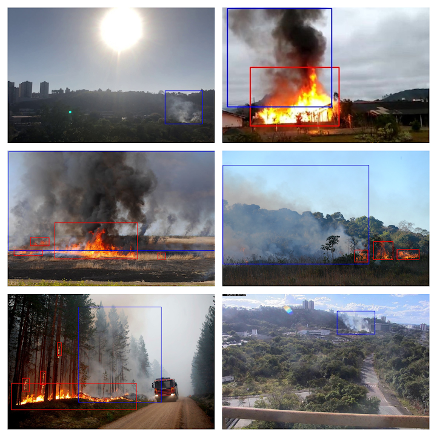
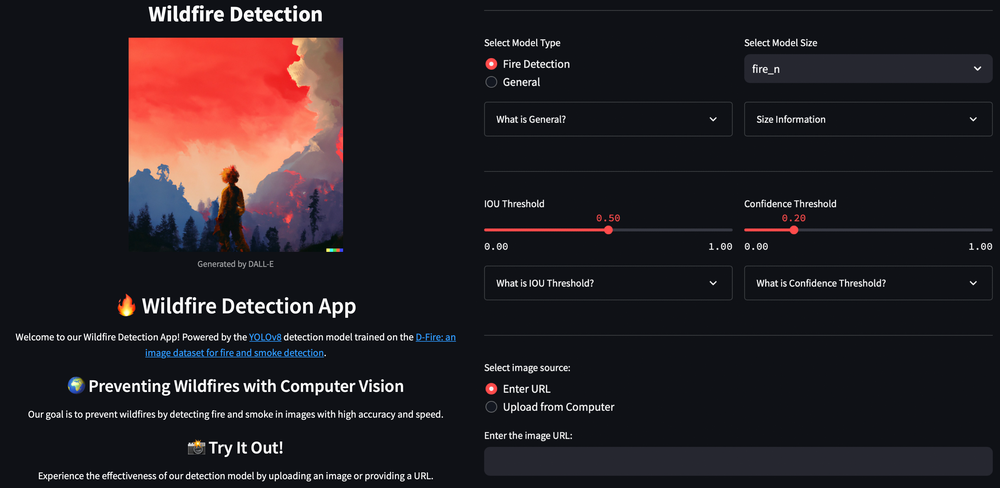

# Wildfire Detection
Welcome to the Wildfire Detection Research repository! This repository hosts the code and resources related to our research on leveraging computer vision for fire detection. Our aim is to contribute to wildfire prevention efforts by developing and training an object detection model to accurately identify instances of fire and smoke in images.

  

## Highlights:

- Trained YOLOv8 model using the D-Fire dataset for accurate fire and smoke detection.
- Explored different model sizes and their performance metrics.
- Developed a Streamlit app for practical demonstration of the model's capabilities.
- Investigated future implications of using computer vision in wildfire prevention strategies.

#### For a comprehensive understanding of our research journey, methodology, and results, please refer to our Medium article: [Stay Ahead of the Flames: A Comprehensive Guide to Wildfire Prevention with YOLOv8](https://medium.com/institute-of-smart-systems-and-ai/stay-ahead-of-the-flames-a-comprehensive-guide-to-wildfire-prevention-with-yolov8-3eb8edd1121a)

---

## Dataset

We utilized the [D-Fire dataset](https://github.com/gaiasd/DFireDataset), a curated collection of 21,000 labeled images, each annotated in YOLO format. The dataset focuses on fire and smoke instances, while also encompassing diverse visual cues, including non-fire images that resemble fire-like patterns.

  

  D-Fire dataset examples

We have explored many different datasets. Here is the summary:

| Dataset                                                                                                                                                                                    | Image type      | Camera                               | \# images                                                                          | Classes                                                                                             | Bounding Boxes |
| ------------------------------------------------------------------------------------------------------------------------------------------------------------------------------------------ | --------------- | ------------------------------------ | ---------------------------------------------------------------------------------- | --------------------------------------------------------------------------------------------------- | -------------- |
| [Wildfire Detection Image Data](https://www.kaggle.com/datasets/brsdincer/wildfire-detection-image-data)                                                                                   | RGB             | Regular                              | 1,875 images                                                                       | \- fire \- no fire                                                                               | no             |
| [Fire Detection Using Surveillance Camera on Roads](https://www.kaggle.com/datasets/tharakan684/urecamain)                                                                                 | RGB             | Surveillance Camera                  | 10,000 images                                                                      | \- fire \- no fire                                                                               | no             |
| [FIRESENSE](https://www.kaggle.com/datasets/chrisfilo/firesense) (Videos)                                                                                                                  | RGB             | Regular, Surveillance Camera         | 11 fire videos 16 non-fire videos  13 smoke videos 13 non-smoke videos | \- fire \- no fire \- smoke \- no smoke                                                    | no             |
| [Aerial Rescue Object Detection](https://www.kaggle.com/datasets/julienmeine/rescue-object-detection)                                                                                      | RGB             | Regular, drone                       | 29,810 images                                                                      | \- human \- fire \- vehicle                                                                   | yes            |
| [Fire detection dataset](https://www.kaggle.com/datasets/jimishpatel/fire-detection-dataset)                                                                                               | RGB             | Regular, Surveillance Camera         | 3,894 images                                                                       | \- fire \- no fire                                                                               | no             |
| [Forest Fire](https://www.kaggle.com/datasets/kutaykutlu/forest-fire)                                                                                                                      | RGB, Gray Scale | Regular, Drone, Surveillance Camera  | 15,800 images                                                                      | \- fire \- smoke                                                                                 | no             |
| [Forest Fire Images](https://www.kaggle.com/datasets/mohnishsaiprasad/forest-fire-images)                                                                                                  | RGB             | Regular                              | 5,000 images                                                                       | \- fire \- no fire                                                                               | no             |
| [Fire Detection in YOLO format](https://www.kaggle.com/datasets/ankan1998/fire-detection-in-yolo-format)                                                                                   | RGB             | Regular                              | 500 images                                                                         | \- fire                                                                                             | yes            |
| [FLAME 2: FIRE DETECTION AND MODELING: AERIAL MULTI-SPECTRAL IMAGE DATASET](https://ieee-dataport.org/open-access/flame-2-fire-detection-and-modeling-aerial-multi-spectral-image-dataset) | RGB, IR         | Drone                                | 53,451 RGB 53,451 IR                                                            | \- fire and smoke \- fire and no smoke \- no fire and smoke \- no fire and no smoke        | no             |
| [Forest Fire Dataset](https://www.kaggle.com/datasets/alik05/forest-fire-dataset)                                                                                                          | RGB             | Regular                              | 1,900 images                                                                       | \- fire \- no fire                                                                               | no             |
| [Open Wildfire Smoke Datasets](https://github.com/aiformankind/wildfire-smoke-dataset/tree/master)                                                                                         | RGB             | Surveillance Camera                  | 2,192 images                                                                       | \- smoke                                                                                            | yes            |
| [AIDER: Aerial Image Database for Emergency Response applications](https://github.com/ckyrkou/AIDER/tree/master)                                                                           | RGB             | Aerial view, regular                 | 500 images for each disaster class 4,000 images for the normal class            | \- Fire/Smoke \- Flood \- Collapsed Building/Rubble \- Traffic Accidents \- Normal case | no             |
| [Furg Fire Dataset](https://github.com/steffensbola/furg-fire-dataset)                                                                                                                     | RGB             | Regular                              | 21 videos                                                                          | \- fire                                                                                             | yes            |
| [Mivia Fire Detection](https://mivia.unisa.it/datasets/video-analysis-datasets/fire-detection-dataset/)                                                                                    | RGB             | Regular                              | 14 fire videos 17 non-fire videos                                               | \- fire \- no fire                                                                               | no             |
| [FireNet](https://github.com/OlafenwaMoses/FireNET)                                                                                                                                        | RGB             | Regular                              | 500 images                                                                         | \- fire                                                                                             | yes            |
| [FIRE Dataset](https://www.kaggle.com/datasets/phylake1337/fire-dataset)                                                                                                                   | RGB             | Regular                              | 755 outdoor-fire images  244 nature images                                      | \- fire \- no fire                                                                               | no             |
| [Fire Detection v2](https://universe.roboflow.com/yi-shing-group-limited/fire-detection-v2-yn3wz)                                                                                          | RGB             | Regular                              | 600 images                                                                         | \- scale1fire \- scale2fire \- scale3fire                                                     | yes            |
| [fireDetection Computer Vision Project](https://universe.roboflow.com/school-tvtyg/firedetection-xxwxc)                                                                                    | RGB             | Regular                              | 9,681 images                                                                       | \- Fire \- fire                                                                                  | yes            |
| [D-Fire](https://github.com/gaiasd/DFireDataset)                                                                                                                                           | RGB             | Regular, Aerial, Surveillance Camera | 21,000 images                                                                      | \- Fire \- Smoke                                                                                 | yes            |
| [Fire-Smoke-Dataset](https://github.com/DeepQuestAI/Fire-Smoke-Dataset)                                                                                                                    | RGB             | Regular                              | 3,000 images                                                                       | \- Fire \- Smoke \- Neutral                                                                   | no             |

---

## Model Training

We trained the YOLOv8 model by [Ultralytics](https://github.com/ultralytics/ultralytics) on the D-Fire dataset to achieve accurate fire and smoke detection. Our research not only focuses on achieving high accuracy but also on optimizing model parameters and hyperparameters to ensure efficiency and speed.

#### Training recipe can be found in a [training-recipes folder](training-recipes)

---

## Results

The trained YOLOv8 model demonstrated impressive performance on the D-Fire test dataset, with mAP@50 scores and inference time across different model sizes as follows. Evaluation was done using NVIDIA A100-SXM4-40. Resolution of input images was 640x640.

| Model Size  | mAP@50 | Inference (ms) |
|-------------|--------|----------------|
| Nano        | 0.787  |     0.422      |
| Small       | 0.798  |     0.773      |
| Medium      | 0.801  |     1.532      |
| Large       | 0.812  |     2.342      |
| Extra Large | 0.814  |     3.465      |

#### For a detailed exploration of our training process and insights, we invite you to read our comprehensive guide on Medium: [Stay Ahead of the Flames: A Comprehensive Guide to Wildfire Prevention with YOLOv8](https://medium.com/institute-of-smart-systems-and-ai/stay-ahead-of-the-flames-a-comprehensive-guide-to-wildfire-prevention-with-yolov8-3eb8edd1121a)

---

## Future Implications

This research underscores the potential of computer vision in addressing real-world challenges, such as wildfire detection. As technology evolves, integrating machine learning tools into wildfire prevention and emergency response strategies could significantly enhance our ability to detect and mitigate wildfires effectively.

---

## Streamlit App

For a practical demonstration of our research, you can interact with our Wildfire Detection App, powered by the YOLOv8 model. This app allows you to upload images and observe the model's detection capabilities in action. 

#### To experience the app, visit: [Wildfire Detection App](https://wildfire-detection.streamlit.app)

  

  Wildfire Detection App

---

## Disclaimer

Please note that while our Streamlit app demonstrates the capabilities of our model, it is intended for demonstration purposes and may not be suitable for critical wildfire detection applications.

---
## Acknowledgment

I would like to acknowledge the Institute of Smart Systems and Artificial Intelligence ([ISSAI](https://issai.nu.edu.kz)) at Nazarbayev University for fostering an environment of innovation and research excellence. The support I received from ISSAI has been integral to the successful completion of this endeavor.

I extend my heartfelt appreciation to my supervisor, [Askat Kuzdeuov](https://www.linkedin.com/in/askatkuzdeuov/), at ISSAI, whose guidance and mentorship were indispensable to the success of this research. His expertise and support have been invaluable in shaping the direction and quality of this work.

I would also like to extend my thanks to the creators of the [D-Fire dataset](https://github.com/gaiasd/DFireDataset) for providing a valuable resource that underpins the foundation of this research. Additionally, the [Ultralytics](https://github.com/ultralytics/ultralytics) team's contribution to the YOLOv8 model has been instrumental in enabling accurate and efficient fire detection.

---

## License

This project is licensed under the [MIT License](https://github.com/git/git-scm.com/blob/main/MIT-LICENSE.txt).
