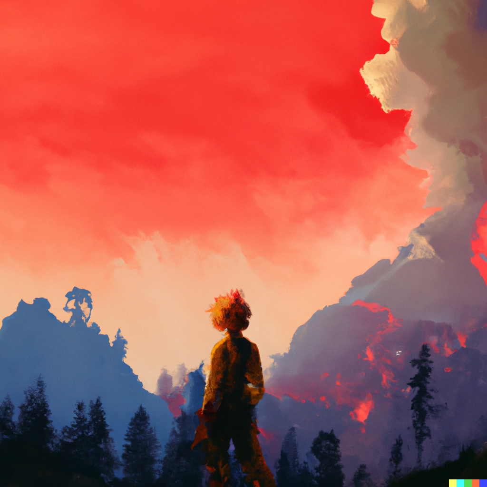

# Wildfire Detection Research

Welcome to the Wildfire Detection Research repository, focusing on fire detection using computer vision. This project aims to contribute to wildfire prevention efforts by leveraging machine learning to detect fire and smoke instances in images.

  

---

## Dataset

We utilized the [D-Fire dataset](https://github.com/gaiasd/DFireDataset), a curated collection of 21,000 labeled images, each annotated in YOLO format. The dataset focuses on fire and smoke instances, while also encompassing diverse visual cues, including non-fire images that resemble fire-like patterns.

---

## Model Training

We trained the YOLOv8 model by [Ultralytics](https://github.com/ultralytics/ultralytics) on the D-Fire dataset to achieve accurate fire and smoke detection. Our research not only focuses on achieving high accuracy but also on optimizing model parameters and hyperparameters to ensure efficiency and speed.

---

## Results

The trained YOLOv8 model demonstrated impressive performance on the D-Fire test dataset, with mAP@50 scores and inference time across different model sizes as follows:

| Model Size  | mAP@50 | Inference (ms) |
|-------------|--------|----------------|
| Nano        | 0.787  |     0.422      |
| Small       | 0.798  |     0.773      |
| Medium      | 0.801  |     1.532      |
| Large       | 0.812  |     2.342      |
| Extra Large | 0.814  |     3.465      |

For a detailed exploration of our training process and insights, we invite you to read our comprehensive guide on Medium: [Guide Link](https://medium.com/your-article-link)

---

## Future Implications

This research underscores the potential of computer vision in addressing real-world challenges, such as wildfire detection. As technology evolves, integrating machine learning tools into wildfire prevention and emergency response strategies could significantly enhance our ability to detect and mitigate wildfires effectively.

---

## Streamlit App

For a practical demonstration of our research, you can interact with our Wildfire Detection App, powered by the YOLOv8 model. This app allows you to upload images and observe the model's detection capabilities in action. To experience the app, visit: [Wildfire Detection App](https://wildfire-detection.streamlit.app)

---

## Disclaimer

Please note that while our Streamlit app demonstrates the capabilities of our model, it is intended for demonstration purposes and may not be suitable for critical wildfire detection applications.

---

## License

This project is licensed under the [MIT License](LICENSE).
