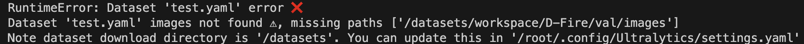
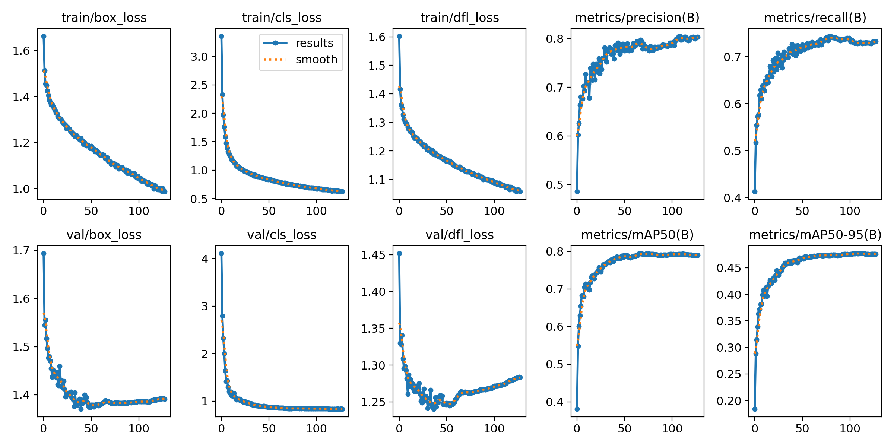
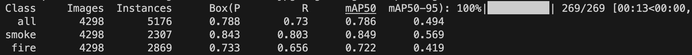
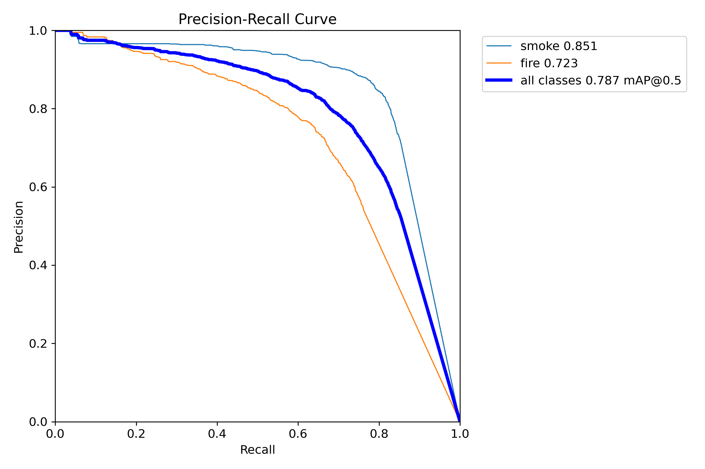
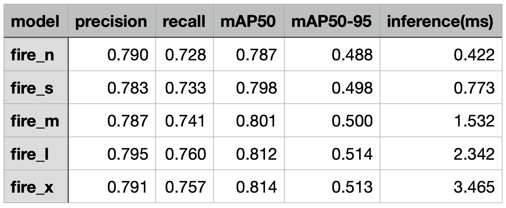

### Download the dataset
To train our model, we first need to download the dataset. You can find the dataset on the [GitHub repository](https://github.com/gaiasd/DFireDataset). Simply follow the provided link to access the dataset on Google Drive, and download it to your local device. Once downloaded, unzip the archive to extract the dataset. If you are using Linux or need to install the dataset on a remote server, you can use the gdown library to download the dataset from Google Drive. First, install the library by running the following command:
```bash
pip install gdown
```
Next, obtain the file ID of the dataset on Google Drive by visiting the dataset's link on GitHub and clicking the "Share" button. The file link will be in the following format:
```bash
https://drive.google.com/file/d/19LSrZHYQqJSdKgH8Mtlgg7-i-L3eRhbh/view?usp=sharing 
```
The file ID in this link is 19LSrZHYQqJSdKgH8Mtlgg7-i-L3eRhbh. To download the dataset using gdown, navigate to the directory where you want to store the dataset and execute the following command:
```bash
gdown 19LSrZHYQqJSdKgH8Mtlgg7-i-L3eRhbh
```

To unzip the downloaded archive, use the following command:
```bash
unzip D-Fire.zip -d path/to/where/you/want/to/unzip
```

### Preprocess the dataset
Once the archive is unzipped, the dataset structure in YOLO format will appear as follows:

```bash
D-Fire
—| train
—---| images
—---| labels
—| test
—---| images
—---| labels
```

The training set contains 17,211 images, while the test set contains 4,306 images. To create a validation set for model tuning, we can use 10% of the training set. You can use your preferred method to split the data. Here is an example of how you can accomplish this using Python:

```python
! pip install shutil

import os
import random
import shutil

train_images_folder = "D-Fire/train/images"
train_labels_folder = "D-Fire/train/labels"
val_images_folder = "D-Fire/val/images"
val_labels_folder = "D-Fire/val/labels"

# Create the validation folders if they don't exist
os.makedirs(val_images_folder, exist_ok=True)
os.makedirs(val_labels_folder, exist_ok=True)

# Get the list of image files in the train set
image_files = os.listdir(train_images_folder)

# Calculate the number of images to move to the validation set
num_val_images = int(0.1 * len(image_files))

# Randomly select the images to move
val_image_files = random.sample(image_files, num_val_images)

# Move the selected images and their corresponding labels to the validation set
for image_file in val_image_files:
   # Move image file
   image_src = os.path.join(train_images_folder, image_file)
   image_dst = os.path.join(val_images_folder, image_file)
   shutil.move(image_src, image_dst)

   # Move label file
   label_file = image_file.replace(".jpg", ".txt")
   label_src = os.path.join(train_labels_folder, label_file)
   label_dst = os.path.join(val_labels_folder, label_file)
   shutil.move(label_src, label_dst)
```

After executing this code, the train, val, and test sets will contain 15,499, 1,722, and 4,306 images, respectively. After that manipulation, the directory tree should look as follows:

```bash
D-Fire
—| train
—---| images
—---| labels
—| val
—---| images
—---| labels
—| test
—---| images
—---| labels
```

### Create a configuration file
Before we start training, we need to create a configuration file that provides information about the dataset. Create an empty file named "data.yaml" and include the following content:

```python
path: /D-Fire
train: train/images  # relative to path
val: val/images # relative to path
test: test/images # relative to path

names:
 0: smoke
 1: fire
```

The path specifies the root directory of the dataset, and the train, val, and test paths indicate the relative paths to the corresponding image directories. The names section maps the class IDs to their respective names.

During training, if the Ultralytics library encounters any issues locating your dataset, it will provide informative error messages to help you troubleshoot the problem. In some cases, you might need to adjust the path parameter in the configuration file to ensure the library can find your dataset successfully.

<p align="center">
  
</p>


<div align="center">
  Fig. 1: Dataset path error
</div>

You might be wondering why we are not explicitly specifying the path to the label files. The reason is that the Ultralytics library automatically replaces the 'images' keyword in the provided paths with 'labels' in the training step. Therefore, it is essential to structure your directory as described earlier to ensure the library can locate the corresponding label files correctly. For more information, please refer to [Ultralytics documentation](https://docs.ultralytics.com/datasets/detect/).

### Start training
To install the necessary packages for training, you can use either pip or conda:
```bash
pip install ultralytics
```
or

```bash
conda install ultralytics
```
Training using Ultralytics is straightforward. We will use a Python script for more flexibility in adjusting hyperparameters. More details can be found [here](https://docs.ultralytics.com/modes/train/). Here is an example of how to train the YOLOv8 model:

```python
from ultralytics import YOLO

# Load a model
model = YOLO('yolov8n.pt')  # load an official model

PROJECT = 'project_name’'  # project name
NAME = 'experiment_name'  # run name

model.train(
   data = 'data.yaml',
   task = 'detect',
   epochs = 200,
   verbose = True,
   batch = 64,
   imgsz = 640,
   patience = 20,
   save = True,
   device = 0,
   workers = 8,
   project = PROJECT,
   name = NAME,
   cos_lr = True,
   lr0 = 0.0001,
   lrf = 0.00001,
   warmup_epochs = 3,
   warmup_bias_lr = 0.000001,
   optimizer = 'Adam',
   seed = 42,
)
```
The data parameter specifies the path to the configuration file we created earlier. You can adjust the hyperparameters to suit your specific requirements. The Ultralytics documentation provides further details on available hyperparameters ([link](https://docs.ultralytics.com/modes/train/#arguments)).

One important note is that Ultralytics does not provide a parameter to change the metric used to determine the best model during training. By default, it uses precision as the metric. If the precision does not improve within the defined patience value (set to 20 in our example), the model training will stop.


## Results
The selected hyperparameters for training proved to be highly effective, leading to smooth convergence and remarkable results. The model training process completed in approximately 130 epochs, demonstrating its efficiency. The training progress can be visualized through the graphs automatically generated by Ultralytics.

<p align="center">
  
</p>

<div align="center">
  Fig. 2: Nano model training graphs
</div>

The training phase yielded two checkpoints: the last one for resuming training and the best one, representing the model with the highest precision. These checkpoints are stored in the "project_name/experiment_name/weights" directory in PyTorch format. Evaluating the best model on the test set can be accomplished using the following Python code:

```python
from ultralytics import YOLO

model = YOLO(‘project_name/experiment_name/weights/best.pt’)

model.val(split='test', batch=48, imgsz=640, verbose=True, conf = 0.1, iou = 0.5)
```
As evident in the code snippet, we can specify the split for evaluation. By default, it refers to the data.yaml file created earlier, which contains the dataset information. However, if needed, you can change the dataset used for evaluation by specifying the "data" parameter. You can explore all the available arguments for the evaluation function [here](https://docs.ultralytics.com/modes/val/#arguments).

<p align="center">
  
</p>
<div align="center">
  Fig. 3: Nano model evaluation logs
</div>

Even the smallest YOLOv8 model nano could reach an outstanding mAP50 of 0.79 on the test set (see Fig. 4). We can see the PR curve and other graphs in the folder that is automatically created at “runs/detect/val” directory.

<p align="center">
  
</p>
<div align="center">
  Fig. 4: Precision-Recall curve of Nano model
</div>

Notably, the evaluation process extends to other model sizes, such as small, medium, large, and extra-large models. Despite the extra-large model being approximately 21 times larger than the nano model in terms of parameters, it only demonstrates a marginal improvement of 0.03 in mAP50 (see Fig. 5). This observation highlights the need to strike a balance between model size and performance based on the specific problem at hand. In production, it may be unnecessary to use larger models unless significant accuracy gains outweigh the resource and time costs associated with their deployment.

<p align="center">
  
</p>
<div align="center">
  Fig. 5: Performances of YOLOv8 models of different sizes
</div>
